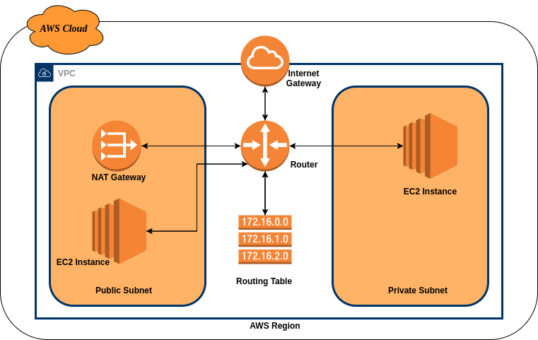

**Basic VPC Solution Guide:**

In this tutorial, we will be using AWS CLI commands to create a non-default VPC with an IPv4 CIDR block, and a public and private subnet in the VPC. After you've created the VPC and subnets, you can launch an instance in the public subnet and connect to it. To begin, you must first install and configure the AWS CLI. 

We will create the following AWS resources:


*   A VPC
*   Two subnets
*   An internet gateway
*   Route tables
*   NAT gateway

**Step 1: Create a VPC and subnets**

The first step is to create a VPC and two subnets. This example uses the CIDR block 10.0.0.0/16 for the VPC, but you can choose a different CIDR block. 

1.  To create a VPC and subnets using the AWS CLI


```
aws ec2 create-vpc --cidr-block 10.0.0.0/16
```


In the output that's returned, take note of the VPC ID.


```
{
        "Vpc": {
             "VpcId": "vpc-2f09a348",
               ...
               }
}
```


2. Using the VPC ID from the previous step, create a subnet with a 10.0.1.0/24 CIDR block.


```
aws ec2 create-subnet --vpc-id vpc-2f09a348 --cidr-block 10.0.1.0/24
```


3. Create a second subnet in your VPC with a 10.0.0.0/24 CIDR block.


```
aws ec2 create-subnet --vpc-id vpc-2f09a348 --cidr-block 10.0.0.0/24
```


**Step 2: Make your subnet public**

After you've created the VPC and subnets, you can make one of the subnets a public subnet by attaching an Internet gateway to your VPC, creating a custom route table, and configuring routing for the subnet to the Internet gateway.

To make your subnet a public subnet

1. Create an Internet gateway.


```
aws ec2 create-internet-gateway
```


In the output that's returned, take note of the Internet gateway ID.


```
{
    "InternetGateway"
	      {
          "InternetGatewayId": "igw-1ff7a07b",

        }
}
```


2. Using the ID from the previous step, attach the Internet gateway to your VPC.


```
aws ec2 attach-internet-gateway --vpc-id vpc-2f09a348 --internet-gatewayid igw-1ff7a07b
```


3. Create a custom route table for your VPC.


```
aws ec2 create-route-table --vpc-id vpc-2f09a348
```


In the output that's returned, take note of the route table ID.


```
{
        "RouteTable": {
        ...
                  "RouteTableId": "rtb-c1c8faa6",
        ...
                       }
}
```


4. Create a route in the route table that points all traffic (0.0.0.0/0) to the Internet gateway


```
aws ec2 create-route --route-table-id rtb-c1c8faa6 --destination-cidr-block 0.0.0.0/0 --gateway-id igw-1ff7a07b
```


5. To confirm that your route has been created and is active, you can describe the route table and view the results.


```
aws ec2 describe-route-tables --route-table-id rtb-c1c8faa6
```


```
{
    "RouteTables": [
        {
            "Associations": [],
            "RouteTableId": "rtb-c1c8faa6",
             "VpcId": "vpc-2f09a348",
            "PropagatingVgws": [],
            "Tags": [],
            "Routes": [
                {
                    "GatewayId": "local",
                    "DestinationCidrBlock": "10.0.0.0/16",
                    "State": "active",
                    "Origin": "CreateRouteTable"
                },
                {
                    "GatewayId": "igw-1ff7a07b",
                    "DestinationCidrBlock": "0.0.0.0/0",
                    "State": "active",
                    "Origin": "CreateRoute"
                }
            ]
        }
    ]
}
```


6. The route table is currently not associated with any subnet. You need to associate it with a subnet in your VPC so that traffic from that subnet is routed to the Internet gateway. First, use the describesubnets command to get your subnet IDs. You can use the --filter option to return the subnets for your new VPC only, and the --query option to return only the subnet IDs and their CIDR blocks.


```
aws ec2 describe-subnets --filters "Name=vpc-id,Values=vpc-2f09a348" --query 'Subnets[*].{ID:SubnetId,CIDR:CidrBlock}'
```


```
[
      {
          "CIDR": "10.0.1.0/24",
          "ID": "subnet-b46032ec"
      },
      {
          "CIDR": "10.0.0.0/24",
          "ID": "subnet-a46032fc"
      }
]
```


7. You can choose which subnet to associate with the custom route table, for example,     subnetb46032ec. This subnet will be your public subnet.


```
aws ec2 associate-route-table --subnet-id subnet-b46032ec --route-table-id rtbc1c8faa6
```


8. You can optionally modify the public IP addressing behavior of your subnet so that an instance launched into the subnet automatically receives a public IP address. Otherwise, you should associate an Elastic IP address with your instance after launch so that it's reachable from the Internet.


```
aws ec2 modify-subnet-attribute --subnet-id subnet-b46032ec --map-public-ip-on-launch
```


9. Now we create an elastic ip in order to associate it with the NAT gateway which we will create in the next step, so below is the command to create or allocate an elastic IP address within a VPC.


```
aws ec2 allocate-address --domain vpc  --region us-east-1 --output json 
```


Output:


```
{
    "PublicIp": "52.2.27.207",
    "AllocationId": "eipalloc-08b840370c0b7f832",
    "PublicIpv4Pool": "amazon",
    "NetworkBorderGroup": "us-east-1",
    "Domain": "vpc"
}
```


10. Creating a NAT gateway:

Creating a NAT gateway in the specified public subnet. This action creates a network interface in the specified subnet with a private IP address from the IP address range of the subnet. Internet-bound traffic from a private subnet can be routed to the NAT gateway, therefore enabling instances in the private subnet to connect to the internet.


```
aws ec2 create-nat-gateway --subnet-id subnet-b46032ec --allocation-id eipalloc-08b840370c0b7f832
```


11.  Create another custom route table for private subnet.


```
aws ec2 create-route-table --vpc-id vpc-2f09a348
```


12. Now create a route in the route table that points all traffic (0.0.0.0/0) to the NAT gateway.


```
aws ec2 create-route --route-table-id rtb-06e5dcc8d80effdf1 --destination-cidr-block 0.0.0.0/0 --nat-gateway-id nat-0ceee23792b37aa32
```


12. Now associate our custom route table with the private subnet


```
aws ec2 associate-route-table --route-table-id rtb-06e5dcc8d80effdf1 --subnet-id subnet-a46032fc
```


**Diagram layout:**


<p id="gdcalert1" ><span style="color: red; font-weight: bold">>>>>>  gd2md-html alert: inline image link here (to images/image1.png). Store image on your image server and adjust path/filename/extension if necessary. </span><br>(<a href="#">Back to top</a>)(<a href="#gdcalert2">Next alert</a>)<br><span style="color: red; font-weight: bold">>>>>> </span></p>



